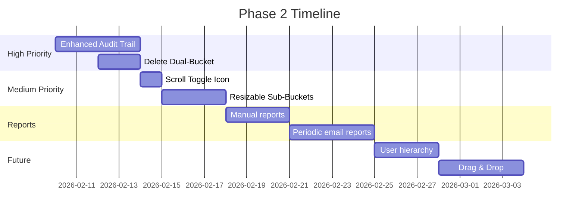

# Phase 2 Implementation Plan

> **Based on:** Feb 1st, 5th, 7th Meeting Transcripts + Feb 7th Email  
> **Status:** Planning  
> **Last Updated:** Feb 8th, 2026  
> **Estimated Effort:** 2-3 weeks

---

## Priority Matrix

| Priority | Category | Items |
|----------|----------|--------------|
| 🔴 HIGH | Core Features | Enhanced audit trail |
| 🟡 MEDIUM | UI | Scroll toggle icon, resizable sub-buckets |
| 🟢 LOW | Reports | Periodic email reports, manual reports |
| 🔵 FUTURE | Advanced | User hierarchy, drag & drop |

---

## 1. 🔴 HIGH PRIORITY

### 1.1 Enhanced Audit Trail ⭐
Full accountability tracking for all query changes:

| Action | Audit Entry Format |
|--------|-------------------|
| Description changed | "Raj changed description (was 'X', now 'Y')" |
| Query type changed | "Smit changed type from New to SEO" |
| Status changed | "Anamika moved from B to C" |
| Date changed | "Nupura changed sent date (was Feb 1, now Feb 5)" |
| Remark added/edited | "Raj added remark: 'client called back'" |
| Assigned/Reallocated | "Smit assigned to Priyasha" |

> [!IMPORTANT]
> Every edit must be documented with WHO changed WHAT (old value → new value) and WHEN.

---

## 2. 🟡 MEDIUM PRIORITY

### 2.1 Scroll Toggle (Newspaper Pagination)

**Current (Horizontal):** Content overflows to the right → horizontal scrollbar

**New (Vertical Pagination):**
- Same newspaper-style column layout (left → right flow)
- When column overflows: items push to next column
- **Key:** If next column can't fit the overflow (due to category header or incomplete block), push entire block to **next vertical page**
- User scrolls **down** to see next page of content

**Example:**
```
Page 1:                          Page 2 (scroll down):
┌─────┬─────┬─────┬─────┐       ┌─────┬─────┬─────┬─────┐
│ New │ SEO │ Ong │     │       │ Ong │     │     │     │
│ 1   │ 1   │ 1   │     │       │ 11  │     │     │     │
│ 2   │ 2   │ 2   │     │       │ 12  │     │     │     │
│ ... │ ... │ ... │     │  →    │     │     │     │     │
│ 10  │ 10  │ 10  │     │       │     │     │     │     │
└─────┴─────┴─────┴─────┘       └─────┴─────┴─────┴─────┘
(Ongoing has 12 items but only 10 fit - remaining 2 go to next page)
```

**UI:**
- [ ] Toggle icon on expanded table top bar
- [ ] Depictive arrows (horizontal ↔ / vertical ↕)

### 2.2 Resizable Sub-Buckets
- [ ] Drag the thin boundary between sub-buckets to resize
- [ ] Within main bucket view
- [ ] User preference saved

---

## 3. 🟢 REPORTS

### 3.1 Report Contents
**Summary (at top):**
- Bucketwise query count: B, C, D, E, F

**Details (per bucket in order B, D, C, E):**
| Query Description | Last Date Field | Remarks |
|-------------------|-----------------|---------|

### 3.2 Periodic Automatic Reports (Email Body)
| Team | Users | Report Sent To |
|------|-------|----------------|
| Smit's Team | User A, B, C + Smit | Pseudo Admin + Admin |
| Anamika's Team | User D, E, F + Anamika | Anamika + Pseudo Admin + Admin |
| Nupura's Team | User X, Y + Nupura | Nupura + Pseudo Admin + Admin |

**Requirements:**
- User-to-team assignment (see User Hierarchy)
- Report in email body (not attachment)
- Weekly schedule (configurable)

### 3.3 Manual Report Generation
- [ ] Admin/Pseudo Admin can generate on-demand
- [ ] Select user(s) + date range
- [ ] Admin + Pseudo Admin email IDs pre-added
- [ ] Option to add more email IDs

---

## 4. 🔵 FUTURE

### 4.1 User Hierarchy System
```
Team Lead (Admin/Pseudo Admin)
├── User A
├── User B
└── User C
```
- Allocate users to specific teams
- Used for grouped reporting
- UI in same interface

### 4.2 Drag & Drop
- [ ] Drag queries between buckets for status change
- [ ] Visual feedback during drag
- [ ] Opens modal for required fields if needed

---

## Already Done ✅ (Phase 1 Completed)

| Feature | Status |
|---------|--------|
| Delete dual-bucket behavior | ✅ Done |
| Cursor jumping in search bar | ✅ Fixed |
| Count discrepancy | ✅ Fixed |
| ESC to close expanded table | ✅ Done |
| Font size (keep as-is) | ✅ Confirmed |
| Horizontal scroll | ✅ Working |
| Undo for Reset | ✅ Working |
| On Hold status button | ✅ Done |
| R icon + tooltip for remarks | ✅ Done |
| Show user name on remark | ✅ Done |
| Empty label hiding | ✅ Done |
| Search by first name/initials | ✅ Done |
| User View Toggle (bucket/status) | ✅ Done |
| Blank query validation | ✅ Done |
| Rename "Add All" to "Submit" | ✅ Done |
| Common notification for bulk add | ✅ Done |
| Add 5/10/15 rows button | ✅ Done |
| Draft retention + Remove All | ✅ Done |
| GM Indicator (E/F buckets) | ✅ Done |
| Single-click self-assign | ✅ Done |
| Display names for users | ✅ Done |
| Expandable bucket view (4x8) | ✅ Done |
| Linear/Non-linear scroll | ✅ Done |
| Del-Rej for all buckets | ✅ Done |
| Assign dropdown with search | ✅ Done |
| Bucket/User filters | ✅ Done |
| Date sorting per bucket | ✅ Done |

---

## Implementation Order



---

## Technical Notes

### For Audit Trail
- Store change history in new sheet column or separate Audit sheet
- Format: `[timestamp] [user] [action] [old] → [new]`
- Display in View/Edit modal

### For Periodic Reports
- Use **n8n workflow** or cron job
- Email via SMTP or SendGrid
- Store team assignments in Users sheet (new column: `Team Lead Email`)

### For Resize/Drag
- Use `react-beautiful-dnd` or similar
- Store user preferences in localStorage
