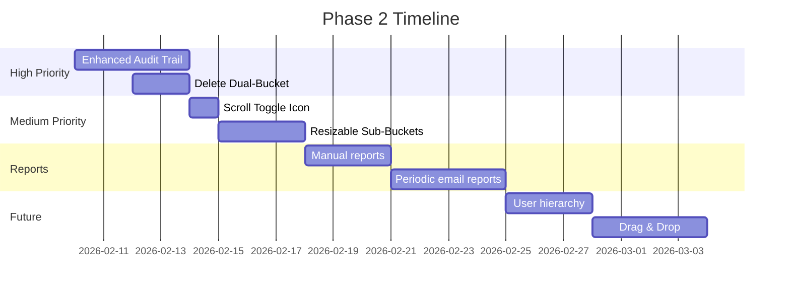

# Phase 2 Implementation Plan

> **Based on:** Jan 24th, 26th, 30th, Feb 1st, 5th, 7th, 14th, 16th Meeting Transcripts + Feb 7th & 16th Emails  
> **Status:** Planning  
> **Last Updated:** Feb 16th, 2026  
> **Estimated Effort:** 2-3 weeks  
> **Phase 1 Client Feedback:** "App is working very well, purpose is fulfilled, no latency issues. Impressed with the work." *(Feb 14th)*

---

## Priority Matrix

| Priority | Category | Items |
|----------|----------|--------------|
| 🔴 HIGH | Core Features | Enhanced audit trail |
| 🟡 MEDIUM | UI | Scroll toggle icon, resizable sub-buckets, save user preferences |
| 🟢 LOW | Reports | Periodic email reports (daily 6:30 PM), manual reports |
| 🔵 FUTURE | Advanced | User hierarchy, drag & drop, web push notifications |
| ⚪ DEFERRED | Infrastructure | PostgreSQL migration, mobile app |

---

## 1. 🔴 HIGH PRIORITY

### 1.1 Enhanced Audit Trail ⭐
Full accountability tracking for all query changes:

| Action | Audit Entry Format |
|--------|-------------------|
| Description changed | "Raj changed description (was 'X', now 'Y')" |
| Query type changed | "Smit changed type from New to SEO" |
| Status changed | "Anamika moved from B to C" |
| Date changed | "Nupura changed sent date (was Feb 1, now Feb 5)" |
| Remark added/edited | "Raj added remark: 'client called back'" |
| Assigned/Reallocated | "Smit assigned to Priyasha" |

> [!IMPORTANT]
> Every edit must be documented with WHO changed WHAT (old value → new value) and WHEN.

> [!WARNING]
> **Audit Trail Scaling Risk (discussed Feb 14th):**  
> Each query generates ~10 audit entries minimum. With 1,000 queries → 10,000 audit rows.  
> Google Sheets performance degrades noticeably beyond 10,000 rows.  
> **Client decision:** Data in buckets E/F becomes less relevant after Salesforce entry, so audit trail can be kept for a limited period only. This reduces the scaling concern but does not eliminate it.  
> **Mitigation:** Consider archiving/purging audit entries older than 3-6 months, or migrating to PostgreSQL when volume grows.

---

## 2. 🟡 MEDIUM PRIORITY

### 2.1 Scroll Toggle (Newspaper Pagination)

> *Discussed: Jan 24, Jan 26, Feb 5, Feb 7*

**Two scroll modes** (toggle between them):

| Mode | Behavior |
|------|----------|
| **Independent (Default)** | Each bucket/user column scrolls independently |
| **Linear (Newspaper)** | All columns scroll together; content flows left → right, then down |

**Newspaper pagination logic:**
- Same column layout (left → right flow)
- When column overflows: items push to next column
- **Key:** If next column can't fit the overflow (due to category header or incomplete block), push entire block to **next vertical page**
- User scrolls **down** to see next page of content

**Example:**
```
Page 1:                          Page 2 (scroll down):
┌─────┬─────┬─────┬─────┐       ┌─────┬─────┬─────┬─────┐
│ New │ SEO │ Ong │     │       │ Ong │     │     │     │
│ 1   │ 1   │ 1   │     │       │ 11  │     │     │     │
│ 2   │ 2   │ 2   │     │       │ 12  │     │     │     │
│ ... │ ... │ ... │     │  →    │     │     │     │     │
│ 10  │ 10  │ 10  │     │       │     │     │     │     │
└─────┴─────┴─────┴─────┘       └─────┴─────┴─────┴─────┘
(Ongoing has 12 items but only 10 fit → remaining 2 go to next page)
```

**UI:**
- [ ] Toggle icon on expanded table top bar
- [ ] **Arrow-based icons** — not text labels (horizontal ↔ / vertical ↕) *(Feb 7 meeting: "depictive arrows")*
- [ ] Remember selected mode per user

> *Meeting quote (Feb 5): "इंडिविजल स्क्रोल बार और मेन स्क्रोल बार यह बहुत इंपोरटेंट है"*

### 2.2 Resizable Sub-Buckets

> *Discussed: Jan 24, Feb 5, Feb 7*

- [ ] Drag the thin boundary between sub-bucket columns to resize
- [ ] Allow expanding a busy bucket wider / shrinking an empty one narrower
- [ ] Drag bottom boundary to allocate more vertical space to a bucket group
- [ ] User preference saved (persist resize state across sessions)

> *Meeting quote (Jan 24): "क्वेरी डिस्क्रिप्शन चालीस कैरेक्टर से ज्यादा नहीं रहेगा तो आप ऑप्टिमाइज करो स्पेस" — Query description won't exceed 40 chars, so optimize space*

### 2.3 Save User Preferences

> *Discussed: Jan 26, Feb 5, Feb 7*

When users customize their view, it must **persist across sessions**:

| Customization | Saved? |
|---------------|--------|
| Active view (Bucket / User) | ✅ |
| Layout mode (Default / Linear) | ✅ |
| Scroll mode (Independent / Newspaper) | ✅ |
| Column widths (after resize) | ✅ |
| User column ordering (User View) | ✅ |
| Sort field per bucket | ✅ |
| Filter selections | ✅ |

- [ ] "Save View" button appears after any customization
- [ ] Save is **per view type** (separate for Bucket View vs User View)
- [ ] "Reset View" / "Clear" button to restore defaults
- [ ] Store in Google Sheets (Preferences tab) + localStorage for immediacy

---

## 3. 🟢 REPORTS *(Updated Feb 16 — Smit's email specifications)*

**Email to:** `ct@blackhattalent.com`  
**Format:** Email body (not attachment), HTML tables  
**Schedule:** Daily at **6:30 PM IST** *(confirmed Feb 16 meeting)*, configurable via n8n workflow

### 3.1 Report 1: Pending / Partially Pending Queries (>2 days old)

**Title:** "Pending / Partially pending queries from more than 2 days ago"

**Buckets:** B (Pending Proposal), D (Partial Proposal), E (Partial Proposal + SF)

**Filter rules:**
- If Query Type = `New` or `Already Allocated` → `Assignment Date Time` > 48 hours ago (excluding Sundays)
- If Query Type = `Ongoing` → `Added Date Time` > 48 hours ago (excluding Sundays)

**Grouping:** Team Lead → User → Bucket (B separate, D & E combined)

**Fields per row:**
| Column 1 | Column 2 | Column 3 |
|----------|----------|----------|
| Bucket + Count | Query Description | Remarks |
| (e.g. "Bucket B Count = 3") | Sorted by date, oldest first | |

**Date column:** `Assignment Date Time` for Bucket B, `Added Date Time` for D/E

### 3.2 Report 2: Pending SF Entries (>2 days old)

**Title:** "Pending SF entries for queries from more than 2 days ago"

**Buckets:** C (Proposal Sent), D (Partial Proposal Sent)

**Filter:** All records in these buckets, sorted date-wise (oldest first)

**Grouping:** Same as Report 1 — Team Lead → User → Bucket

**Fields:** Same 3 columns as Report 1

### 3.3 Report Format (from Smit's example)

```
Report 1
━━━━━━━━━━━━━━━━━━━━━━━━━━━━
Smit Bhanushali team
────────────────────
  Ronak Acharya
  ┌──────────────────────────┬─────────────────────┬──────────────┐
  │ Bucket B (pending)       │ Query desc ABC      │ Remarks 123  │
  │ Count = 3                │ Query desc DEF      │ Remarks 345  │
  │                          │ Query desc GHI      │ Remarks 678  │
  ├──────────────────────────┼─────────────────────┼──────────────┤
  │ Bucket D & E (partial)   │ Query desc JKL      │ Remarks 901  │
  │ Count = 2                │ Query desc MNO      │ Remarks 234  │
  └──────────────────────────┴─────────────────────┴──────────────┘

  Meet Prajapati
  [same structure...]

Anamika Asrani team
────────────────────
  [same structure...]
```

### 3.4 Prerequisites

- [ ] Add `Team Lead` column (G) to Users sheet — maps each user to their team lead's email
- [ ] Update `SHEET_RANGES.USERS` to `Users!A:G`
- [ ] Update `User` interface to include `"Team Lead"` field
- [ ] Configure SMTP credentials in n8n
- [ ] Get team assignments from client (who belongs to which team)

### 3.5 Implementation Approach

- **n8n workflow** with Schedule Trigger → Google Sheets read → Code node (filter/group/format) → Send Email
- 48-hour threshold calculation skips Sundays (business days only)
- Empty groups omitted (users with 0 pending queries not shown)

### 3.6 Manual Report Generation (Future)
- [ ] Admin/Pseudo Admin can generate on-demand
- [ ] Select user(s) + date range
- [ ] Admin + Pseudo Admin email IDs pre-added
- [ ] Option to add more email IDs

---

## 5. ⚠️ KNOWN LIMITATIONS & CAUTIONS

> *Discussed in Feb 14th meeting. Client requested these be documented for future reference.*

### 5.1 Google Sheets Rate Limiting

| Parameter | Value |
|-----------|-------|
| API Limit | **60 requests/minute** (Google Sheets API v4) |
| Current Users | ~5-10 (safe zone) |
| Auto-refresh | Every 1 minute per user |
| Risk Threshold | **50+ concurrent users** |

> [!CAUTION]
> **At 50 users:** 50 auto-refresh reads/min + manual actions = likely hitting 60 req/min limit.  
> **At 20 users:** Generally safe, but burst activity (e.g., everyone adding queries in the same minute) could temporarily hit the limit.  
> **Current status:** Never hit the limit so far *(confirmed Feb 14th)*.  
> **Increasing the limit** requires a formal request to Google (not a paid upgrade) — must demonstrate usage and request via Google Cloud Console.

**When limit is hit:**
- API returns `429 Too Many Requests`
- App will show stale data or fail to save
- Affects ALL users simultaneously

**Client decision (Feb 14th):** Not a burning problem right now. Will address when nearing the limit. Developer to guide via virtual call when needed.

### 5.2 Google Sheets Data Volume

| Concern | Threshold | Impact |
|---------|-----------|--------|
| Query rows | 5,000+ rows | Noticeable read latency |
| Total rows (with audit) | 10,000+ rows | Significant latency on all operations |
| Cell count | 200,000+ cells | Hard limit risk |

> [!WARNING]
> **Audit trail is the main risk multiplier.** 1,000 queries × 10 audit entries = 10,000 rows in audit sheet alone.  
> **Client's context:** Queries that reach Salesforce (buckets E/F) become less relevant in the tracker. Audit trail doesn't need to be kept indefinitely.  
> **Recommendation:** Implement periodic archival (e.g., move 3+ month old F/G data to an archive sheet).

### 5.3 PostgreSQL Migration (Deferred)

**Discussed Feb 14th — client acknowledged but deferred.**

| Factor | Google Sheets | PostgreSQL |
|--------|--------------|------------|
| Speed | 200-500ms per API call | 5-20ms queries |
| Concurrent users | ⚠️ 60 req/min hard limit | ✅ Thousands |
| Audit trail | Painful (string/separate sheet) | ✅ Native table + triggers |
| Reports/aggregation | Complex | ✅ SQL queries |
| Cost | Free (Google) | ~$0-15/mo (Supabase/Neon free tier) |
| Client data visibility | ✅ Can see data in Sheets | ❌ Needs admin panel or read-only Sheets sync |
| Migration effort | N/A | ~3-5 days |

**Client's position:** *"The problem is far from us right now. When we're closer to it, we'll deal with it. But document it so we know it was anticipated."*

**Recommended trigger for migration:**
- When audit trail exceeds 5,000 rows, OR
- When team grows beyond 30 users, OR
- When latency complaints begin

### 5.4 Mobile Strategy (Undecided)

**Feb 14th discussion — no decision yet.**

| Option | Pros | Cons | Estimated Effort |
|--------|------|------|------------------|
| **PWA (Progressive Web App)** | Same codebase, installable on phones, works offline | Limited native features | 1-2 weeks |
| **Responsive Web** | Simplest, no extra build | Not app-like experience | 3-5 days |
| **Native App (React Native)** | Best UX, app store presence | Separate codebase, costly | 4-6 weeks |

> [!NOTE]
> Client has not yet decided on mobile approach. They will first review the current app on mobile browser to understand what's available, then provide requirements.  
> **Budget context:** Project budget is $250/month — native app development would exceed this significantly.  
> **Recommendation:** PWA is the most cost-effective path. Current Next.js app can be made into a PWA with minimal effort.

---

## 4. 🔵 FUTURE

### 4.1 User Hierarchy System

> *Discussed: Feb 7, Feb 16*

```
Team Lead (Admin/Pseudo Admin)
├── User A
├── User B
└── User C
```
- Allocate users to specific teams (3 teams: Smit, Anamika, Nupura)
- Used for grouped reporting (prerequisite for email reports)
- Will eventually support UI filtering ("show only my team's queries")

### 4.2 Drag & Drop

> *Discussed: Jan 26, Feb 5, Feb 7*

**Type A — Drag query between buckets (Status Change):**
- [ ] Drag a query card from one bucket column to another → triggers status change
- [ ] Only valid status transitions allowed (can't skip steps)
- [ ] **Must open a modal** for mandatory fields (e.g., B → C requires Proposal Sent Date)
- [ ] Visual feedback during drag (highlight valid drop targets)

> *Meeting quote (Feb 5): "ड्रैग करके अगर... तो मुझे वह पूछे... mandatory fields वह मुझे बताएगा" — If I drag, it should ask me... mandatory fields will be shown*

**Type B — Drag to reorder columns/users:**
- [ ] In User View: drag user columns to reorder (e.g., move Smit's column before Anamika's)
- [ ] In Bucket View: drag bucket columns to reorder
- [ ] Saved as user preference

### 4.3 Web Push Notifications 🆕

> *New requirement — Feb 16*

When a query is **assigned to a user**, that user receives a browser push notification.

**Implementation levels:**

| Level | Approach | Effort |
|-------|----------|--------|
| **Basic** | In-app toast on page refresh when new assignment detected | 1 day |
| **Medium** | Browser Push Notification via Service Worker (Web Push API + VAPID keys) | 2-3 days |
| **Advanced** | Push + notification center (bell icon with unread count) | 4-5 days |

**Requirements:**
- [ ] Notification trigger: after successful assignment POST
- [ ] Content: "New query assigned: [Query Description]"
- [ ] Permission flow: user must grant browser notification permission on first use
- [ ] Fallback: if permission not granted, show in-app toast instead
- [ ] Store push subscriptions (Preferences sheet or separate Subscriptions sheet)

---

## Already Done ✅ (Phase 1 Completed)

| Feature | Status |
|---------|--------|
| Delete dual-bucket behavior | ✅ Done |
| Cursor jumping in search bar | ✅ Fixed |
| Count discrepancy | ✅ Fixed |
| ESC to close expanded table | ✅ Done |
| Font size (keep as-is) | ✅ Confirmed |
| Horizontal scroll | ✅ Working |
| Undo for Reset | ✅ Working |
| On Hold status button | ✅ Done |
| R icon + tooltip for remarks | ✅ Done |
| Show user name on remark | ✅ Done |
| Empty label hiding | ✅ Done |
| Search by first name/initials | ✅ Done |
| User View Toggle (bucket/status) | ✅ Done |
| Blank query validation | ✅ Done |
| Rename "Add All" to "Submit" | ✅ Done |
| Common notification for bulk add | ✅ Done |
| Add 5/10/15 rows button | ✅ Done |
| Draft retention + Remove All | ✅ Done |
| GM Indicator (E/F buckets) | ✅ Done |
| Single-click self-assign | ✅ Done |
| Display names for users | ✅ Done |
| Expandable bucket view (4x8) | ✅ Done |
| Linear/Non-linear scroll | ✅ Done |
| Del-Rej for all buckets | ✅ Done |
| Assign dropdown with search | ✅ Done |
| Bucket/User filters | ✅ Done |
| Date sorting per bucket | ✅ Done |

---

## Implementation Order



---

## Technical Notes

### For Audit Trail
- Store change history in **separate Audit sheet** (not same sheet as queries — to avoid row count bloat)
- Format: `[timestamp] [user] [action] [old] → [new]`
- Display in View/Edit modal
- **Retention policy:** Consider auto-archiving entries older than 3 months
- **Scaling plan:** If audit sheet exceeds 5,000 rows, evaluate PostgreSQL migration

### For Periodic Reports
- Use **n8n workflow** or cron job
- Email via SMTP or SendGrid
- Store team assignments in Users sheet (new column: `Team Lead Email`)

### For Resize/Drag
- Use `react-beautiful-dnd` or `@dnd-kit/core` (more modern, better maintained)
- Resize via CSS `resize` or custom drag handles
- Store user preferences in localStorage + Google Sheets Preferences tab

### For Web Push Notifications
- Use **Web Push API** with VAPID keys (serverless compatible with Next.js API routes)
- Service Worker registration for push notifications (PWA-ready)
- Store push subscriptions server-side (Preferences sheet or dedicated sheet)
- Fallback: polling-based in-app toast for users who deny permission

### Rate Limit Mitigation Strategies
- **Batch reads:** Fetch all data in single API call (already implemented)
- **Optimistic updates:** Don't wait for sheet confirmation before updating UI (already implemented)
- **Increase refresh interval:** If approaching limits, increase from 1 min to 2-3 min
- **Caching layer:** Consider localStorage caching with delta sync
- **Google quota request:** When needed, request increased quota via Google Cloud Console (guided process)

---

## Meeting Log

| Date | Key Decisions |
|------|---------------|
| Jan 24 | Initial requirements gathering |
| Jan 26 | Bucket workflow, RBAC roles defined |
| Jan 30 | Additional clarifications |
| Feb 1 | Phase 1 feature finalization |
| Feb 5 | RBAC details, delete workflow, audit fields |
| Feb 7 | Phase 1 review, Phase 2 scoping |
| Feb 14 | **Phase 1 approved.** Discussed: Sheets limitations (rate limits, audit scaling), PostgreSQL migration (deferred), mobile strategy (undecided). Client satisfied with Phase 1 quality and latency. Requested all future risks be documented. |
| Feb 16 | **Report specs finalized** (Smit's email). Schedule: daily 6:30 PM IST. Two reports defined with exact filtering/grouping. Web push notifications added as new requirement. Smit confirmed report format same evening. Target: complete reports by Friday. |
