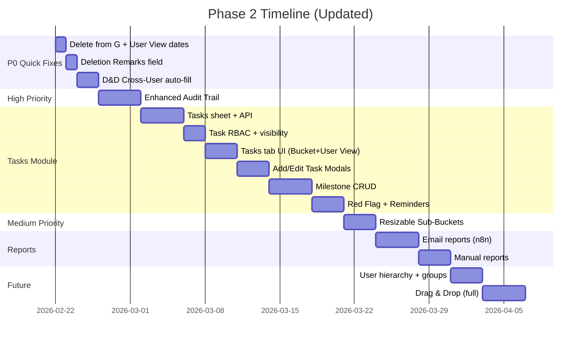

# Phase 2 Implementation Plan

> **Based on:** Jan 24th, 26th, 30th, Feb 1st, 5th, 7th, 14th, 16th, **21st** Meeting Transcripts + Feb 7th & 16th Emails  
> **Status:** Planning  
> **Last Updated:** Feb 21st, 2026  
> **Estimated Effort:** 5-7 weeks (35-45 days with AI-assisted dev)  
> **Phase 1 Client Feedback:** "App is working very well, purpose is fulfilled, no latency issues. Impressed with the work." *(Feb 14th)*

---

## Priority Matrix

| Priority | Category | Items |
|----------|----------|--------------|
| 🔴 P0 | Quick Fixes | Delete from G, User View dates bug, Deletion Remarks field, D&D cross-user auto-fill |
| 🔴 HIGH | Core Features | Enhanced audit trail, **Task Tracker module** (FRD received 21 Feb) |
| 🟡 MEDIUM | UI | Resizable sub-buckets, save user preferences, separate Restore View/Filter |
| 🟢 LOW | Reports | Periodic email reports (daily 6:00 PM), manual reports |
| 🔵 FUTURE | Advanced | User hierarchy + groups, drag & drop (with undo), web push notifications |
| ⚪ DEFERRED | Infrastructure | PostgreSQL migration |
| ❌ REMOVED | — | ~~Scroll toggle (newspaper pagination)~~ *(Feb 21 decision)*, ~~Native mobile app~~ |

---

## 1. 🔴 HIGH PRIORITY

### 1.1 Enhanced Audit Trail ⭐
Full accountability tracking for all query changes:

| Action | Audit Entry Format |
|--------|-------------------|
| Description changed | "Raj changed description (was 'X', now 'Y')" |
| Query type changed | "Smit changed type from New to SEO" |
| Status changed | "Anamika moved from B to C" |
| Date changed | "Nupura changed sent date (was Feb 1, now Feb 5)" |
| Remark added/edited | "Raj added remark: 'client called back'" |
| Assigned/Reallocated | "Smit assigned to Priyasha" |

> [!IMPORTANT]
> Every edit must be documented with WHO changed WHAT (old value → new value) and WHEN.

> [!WARNING]
> **Audit Trail Scaling Risk (discussed Feb 14th):**  
> Each query generates ~10 audit entries minimum. With 1,000 queries → 10,000 audit rows.  
> Google Sheets performance degrades noticeably beyond 10,000 rows.  
> **Client decision:** Data in buckets E/F becomes less relevant after Salesforce entry.  
> **Retention:** Archive after **1 month** — manually move old audit trails to a separate "Archive" sheet within the same spreadsheet. *(Confirmed Feb 21)*

---

### 1.2 Task Tracker Module 🆕 *(FRD received Feb 21)*

> [!IMPORTANT]
> **Entirely new module** — a separate "Tasks" tab within the dashboard. Independent data, buckets, types, and RBAC rules. Tasks are NOT visible in the Queries tab and vice versa.
> **Source:** [FRD_Phase2_Tasks_Module.md](file:///c:/Users/ereny/Desktop/clients/query-tracker/docs/FRD_Phase2_Tasks_Module.md)

#### Task Buckets (5 only — NOT the same as Query's 8)

| Bucket | Label (Task-specific) | Query Equivalent |
|--------|----------------------|------------------|
| **A** | New & Unassigned | Same as Query A |
| **B** | Assigned & Pending / Recurring | ~Query B |
| **C** | Majorly finished, some parts pending | ~Query D (partial) |
| **F** | Finished & Closed | ~Query F |
| **H** | Discarded / Deleted | Same as Query H |

> [!NOTE]
> Buckets D, E, G are **skipped** for Tasks. Letter labels kept consistent with Queries for shared component reuse.
> FRD allows renaming bucket labels specifically for Tasks if feasible.

#### Task Types (2 only)

| Type | Description |
|------|-------------|
| **One-time** | Simple task with optional targeted completion date |
| **Ongoing / Recurring** | Has milestones, reminders (Daily/Weekly/Monthly/Quarterly/Half-yearly/Annually), snooze |

#### RBAC — Tasks (DIFFERENT from Queries)

| Role | Assignment | Visibility | Edit |
|------|-----------|------------|------|
| **Junior** | Self-assign only | Bucket A + own tasks | Own tasks only |
| **Senior** | Any junior, any senior, self. **Group assign** (multiple users at once) | Bucket A + juniors' tasks + own. **❌ Cannot see other seniors'/admin/pseudo-admin tasks** | Own + juniors' tasks |
| **Pseudo Admin / Admin** | Anyone | All tasks, all users | All tasks |

> [!WARNING]
> **Senior visibility is restricted** — unlike Queries where seniors see everything, in Tasks seniors **cannot** see other seniors' work. This needs a separate visibility filter.

#### Task Fields

| Field | Details |
|-------|---------|
| Task ID | Auto-generated (`TK-XXXX`), unique |
| Task Description | Required, clickable to open detail view |
| Task Type | Ongoing/Recurring or One-Time |
| Assigned To | Individual user(s) — supports group assignment |
| Added Date | Mandatory, auto-filled |
| Assigned Date | Mandatory, auto-filled on assignment |
| Red Flag | Boolean — icon-only urgency tag (flagged tasks sort to TOP of bucket+type) |
| Targeted Completion Date | One-Time only, manual entry, optional |
| Reminder Frequency | Ongoing only: Daily/Weekly/Monthly/Quarterly/Half-yearly/Annually |
| Remarks | Free text |
| Deletion Remarks | Separate field, prompted in H |

#### 🚩 Red Flag System
- Icon-only (no text label)
- Flags a task as urgent/critical
- Flagged tasks **sort to the top** within their bucket and type group
- Any authorized user can toggle the flag

#### Milestones (Ongoing/Recurring Tasks Only)

Each ongoing/recurring task has a milestone system:

| Field | Details |
|-------|---------|
| Milestone Sr. No. | Auto-incremented, **user can reorder** |
| Description | Required at Milestone 1 creation |
| Targeted Date | Optional (even at allocation) |
| Actual Completed Date | **Required** to mark milestone as complete |
| Remarks | Optional notes |

**Rules:**
- **Milestone 1 must be defined at allocation** (when task is assigned)
- Date fields are optional at allocation stage
- Max **10 active (open) milestones** at any time
- Completed milestones don't count toward the 10 limit
- Completed milestones **move below** active ones in **descending order** (last completed first)
- Default: Only **latest 3 completed milestones** visible (collapsed single-line)
  - Example: `"Milestone 1 – Completed on: 15/02/2026"`
- Click to expand full history

#### Reminder System (Ongoing/Recurring)
- Quick select: Daily, Weekly, Monthly, Quarterly, Half-yearly, Annually
- **Snooze/Postpone** on each reminder
- Notification: Dashboard bell + email to assignee + pseudo admin + admin

#### Task Notifications
- Task assignment triggers: **dashboard notification + email**
- Email recipients: assignee + pseudo admin + admin
- Milestone additions: notify assigned user + admins

#### Data Model — Proposed

**"Tasks" sheet** (new tab, separate from Queries):
| Col | Field | Notes |
|-----|-------|-------|
| A | Task ID | `TK-XXXX` |
| B | Task Description | Required |
| C | Task Type | Enum |
| D | Status | A/B/C/F/H |
| E-F | Added By / Date | Auto-filled |
| G | Assigned To | Supports CSV for group |
| H-I | Assigned By / Date | Auto-filled |
| J | Red Flag | Boolean |
| K | Remarks | Text |
| L | Targeted Completion Date | One-Time only |
| M-O | Reminder fields | Frequency, Next Date, Snoozed Until |
| P-Q | Finished / Discarded Date | Bucket F/H |
| R | Deletion Remarks | Separate field |
| S-V | Delete workflow fields | Same pattern as Queries |
| W-Y | Audit fields | Last Edited By/Date, Last Activity |

**"Task Milestones" sheet** (separate):
| Col | Field | Notes |
|-----|-------|-------|
| A | Task ID | FK to Tasks |
| B | Milestone Sr. No. | Reorderable |
| C | Description | Required at M1 |
| D | Targeted Date | Optional |
| E | Actual Completed Date | Required to complete |
| F | Remarks | Optional |
| G-H | Created By / Date | |
| I | Status | Active / Completed |

#### Open Questions (Need Client Decisions)

1. **Group Assignment**: Does assigning to 3 people create 3 separate task copies or 1 task with multiple assignees (CSV)?
2. **Task ID visibility**: FRD says TBD — recommend showing it like `TK-1042`
3. **Milestone reordering UX**: Drag-and-drop or up/down arrows?
4. **Reminder infrastructure**: n8n scheduler or API-based?
5. **Who can toggle Red Flag?**: Any user or Admin/Senior only?

---

### 1.3 Quick Fixes (P0 — from 21 Feb conversation) 🆕

These are independent of the Tasks module and can ship immediately:

| Fix | Details | Effort |
|-----|---------|--------|
| **Delete from Bucket G** | Allow delete action from G (Discarded → H). Currently restricted. | 1 hr |
| **User View — Bucket Dates** | Show bucket-specific date (Assignment Date for B, Proposal Sent for C/D, SF Entry for E/F, Discarded for G) instead of Added Date everywhere | 2-3 hrs |
| **Deletion Remarks field** | New separate field prompted when moving to G or H. Auto-populates from existing Remarks if empty | 3-4 hrs |
| **D&D Cross-User Reassignment** | Dragging from User X's Bucket B → User Y's Bucket E: auto-fills Entered In SF Date (same logic as manual bucket change), opens modal for optional SF fields | 4-6 hrs |

---

## 2. 🟡 MEDIUM PRIORITY

### ~~2.1 Scroll Toggle (Newspaper Pagination)~~ ❌ REMOVED

> [!CAUTION]
> **Removed per Feb 21 decision.** Keep horizontal scroll as-is. No vertical/newspaper pagination mode.

### 2.2 Resizable Sub-Buckets

> *Discussed: Jan 24, Feb 5, Feb 7*

- [ ] Drag the thin boundary between sub-bucket columns to resize
- [ ] Allow expanding a busy bucket wider / shrinking an empty one narrower
- [ ] **Column width:** 120px min, 500px max — content overflows at 120px
- [ ] **Height resize:** Zero-sum — increasing one bucket's height decreases adjacent bucket's height
- [ ] Drag bottom boundary to allocate more vertical space to a bucket group
- [ ] User preference saved (persist resize state across sessions — auto-save)

> *Meeting quote (Jan 24): "क्वेरी डिस्क्रिप्शन चालीस कैरेक्टर से ज्यादा नहीं रहेगा तो आप ऑप्टिमाइज करो स्पेस" — Query description won't exceed 40 chars, so optimize space*

### 2.3 Save User Preferences

> *Discussed: Jan 26, Feb 5, Feb 7*

When users customize their view, it must **persist across sessions**:

| Customization | Saved? |
|---------------|--------|
| Active view (Bucket / User) | ✅ |
| Layout mode (Default / Linear) | ✅ |
| Scroll mode (Independent / Newspaper) | ✅ |
| Column widths (after resize) | ✅ |
| User column ordering (User View) | ✅ |
| Sort field per bucket | ✅ |
| Filter selections | ✅ |

- [ ] **"Restore View"** button resets layout (widths, heights, scroll mode) to equal defaults
- [ ] **"Restore Filter"** button resets filter selections to show all
- [ ] Save is **per view type** (separate for Bucket View vs User View)
- [ ] Layout changes (widths, heights) are **auto-saved** — no manual save needed
- [ ] **"Save View" button** is only for saving filter selections
- [ ] Store in Google Sheets (Preferences tab) + localStorage for immediacy

---

## 3. 🟢 REPORTS *(Updated Feb 16 — Smit's email specifications)*

**Email to:** Admins + Pseudo-Admins + optional custom email addresses  
**Format:** Email body (not attachment), HTML tables  
**Schedule:** Daily at **6:00 PM IST** *(corrected Feb 21 meeting)*, excluding Sundays, configurable via n8n workflow  
**Empty reports:** Send with "No pending items" message (do NOT skip)

### 3.1 Report 1: Pending / Partially Pending Queries (>2 days old)

**Title:** "Pending / Partially pending queries from more than 2 days ago"

**Buckets:** B (Pending Proposal), D (Partial Proposal), E (Partial Proposal + SF)

**Filter rules:**
- If Query Type = `New` or `Already Allocated` → `Assignment Date Time` > 48 hours ago (excluding Sundays)
- If Query Type = `Ongoing` → `Added Date Time` > 48 hours ago (excluding Sundays)

**Grouping:** Team Lead → User → Bucket (B separate, D & E combined)

**Fields per row:**
| Column 1 | Column 2 | Column 3 |
|----------|----------|----------|
| Bucket + Count | Query Description | Remarks |
| (e.g. "Bucket B Count = 3") | Sorted by date, oldest first | |

**Date column:** `Assignment Date Time` for Bucket B, `Added Date Time` for D/E

### 3.2 Report 2: Pending SF Entries (>2 days old)

**Title:** "Pending SF entries for queries from more than 2 days ago"

**Buckets:** C (Proposal Sent), D (Partial Proposal Sent)

**Filter:** All records in these buckets, sorted date-wise (oldest first)

**Grouping:** Same as Report 1 — Team Lead → User → Bucket

**Fields:** Same 3 columns as Report 1

### 3.3 Report Format (from Smit's example)

```
Report 1
━━━━━━━━━━━━━━━━━━━━━━━━━━━━
Smit Bhanushali team
────────────────────
  Ronak Acharya
  ┌──────────────────────────┬─────────────────────┬──────────────┐
  │ Bucket B (pending)       │ Query desc ABC      │ Remarks 123  │
  │ Count = 3                │ Query desc DEF      │ Remarks 345  │
  │                          │ Query desc GHI      │ Remarks 678  │
  ├──────────────────────────┼─────────────────────┼──────────────┤
  │ Bucket D & E (partial)   │ Query desc JKL      │ Remarks 901  │
  │ Count = 2                │ Query desc MNO      │ Remarks 234  │
  └──────────────────────────┴─────────────────────┴──────────────┘

  Meet Prajapati
  [same structure...]

Anamika Asrani team
────────────────────
  [same structure...]
```

### 3.4 Prerequisites

- [ ] Add `Team Lead` column (G) to Users sheet — maps each user to their team lead's email
- [ ] Update `SHEET_RANGES.USERS` to `Users!A:G`
- [ ] Update `User` interface to include `"Team Lead"` field
- [ ] Configure SMTP credentials in n8n
- [ ] Get team assignments from client (who belongs to which team)

### 3.5 Implementation Approach

- **n8n workflow** with Schedule Trigger → Google Sheets read → Code node (filter/group/format) → Send Email
- 48-hour threshold calculation skips Sundays (business days only)
- Empty groups omitted (users with 0 pending queries not shown)

### 3.6 Manual Report Generation
- [ ] Admin/Pseudo Admin can generate on-demand *(confirmed in Phase 2 scope — Feb 21)*
- [ ] Select user(s) + date range
- [ ] Admin + Pseudo Admin email IDs pre-added
- [ ] Option to add more email IDs
- [ ] "No pending items" message if no relevant data found

---

## 5. ⚠️ KNOWN LIMITATIONS & CAUTIONS

> *Discussed in Feb 14th meeting. Client requested these be documented for future reference.*

### 5.1 Google Sheets Rate Limiting

| Parameter | Value |
|-----------|-------|
| API Limit | **60 requests/minute** (Google Sheets API v4) |
| Current Users | ~5-10 (safe zone) |
| Auto-refresh | Every 1 minute per user |
| Risk Threshold | **50+ concurrent users** |

> [!CAUTION]
> **At 50 users:** 50 auto-refresh reads/min + manual actions = likely hitting 60 req/min limit.  
> **At 20 users:** Generally safe, but burst activity (e.g., everyone adding queries in the same minute) could temporarily hit the limit.  
> **Current status:** Never hit the limit so far *(confirmed Feb 14th)*.  
> **Increasing the limit** requires a formal request to Google (not a paid upgrade) — must demonstrate usage and request via Google Cloud Console.

**When limit is hit:**
- API returns `429 Too Many Requests`
- App will show stale data or fail to save
- Affects ALL users simultaneously

**Client decision (Feb 14th):** Not a burning problem right now. Will address when nearing the limit. Developer to guide via virtual call when needed.

### 5.2 Google Sheets Data Volume

| Concern | Threshold | Impact |
|---------|-----------|--------|
| Query rows | 5,000+ rows | Noticeable read latency |
| Total rows (with audit) | 10,000+ rows | Significant latency on all operations |
| Cell count | 200,000+ cells | Hard limit risk |

> [!WARNING]
> **Audit trail is the main risk multiplier.** 1,000 queries × 10 audit entries = 10,000 rows in audit sheet alone.  
> **Client's context:** Queries that reach Salesforce (buckets E/F) become less relevant in the tracker. Audit trail doesn't need to be kept indefinitely.  
> **Recommendation:** Implement periodic archival (e.g., move 3+ month old F/G data to an archive sheet).

### 5.3 PostgreSQL Migration (Deferred)

**Discussed Feb 14th — client acknowledged but deferred.**

| Factor | Google Sheets | PostgreSQL |
|--------|--------------|------------|
| Speed | 200-500ms per API call | 5-20ms queries |
| Concurrent users | ⚠️ 60 req/min hard limit | ✅ Thousands |
| Audit trail | Painful (string/separate sheet) | ✅ Native table + triggers |
| Reports/aggregation | Complex | ✅ SQL queries |
| Cost | Free (Google) | ~$0-15/mo (Supabase/Neon free tier) |
| Client data visibility | ✅ Can see data in Sheets | ❌ Needs admin panel or read-only Sheets sync |
| Migration effort | N/A | ~3-5 days |

**Client's position:** *"The problem is far from us right now. When we're closer to it, we'll deal with it. But document it so we know it was anticipated."*

### 5.4 Mobile Strategy — **Optimized Web** ✅ Decided

> *Feb 21 decision: Optimized web view, no native app.*

- Focus on making the existing Next.js app mobile-responsive
- No separate native Android/iOS app
- PWA upgrade remains an option for installability

---

## 4. 🔵 FUTURE

### 4.1 User Hierarchy & Groups System

> *Discussed: Feb 7, Feb 16, **Feb 21***

**Hierarchy:**
```
Admin / Pseudo-Admin
├── Team Lead (Smit, Anamika, Nupura)
│   ├── Senior (Sub-Lead)
│   │   ├── Junior User A
│   │   └── Junior User B
│   └── Junior User C (direct report)
```

**User Groups (NEW — Feb 21):**
- Users can be organized into **named groups** (e.g., "Client Servicing Team", "Account Team")
- Senior/Team Lead users can assign tasks to an **entire group**, notifying all members
- A user can belong to **multiple groups**
- Groups are defined during user creation or edited later
- **Request-based** changes — adding/removing users from groups requires Admin/Pseudo-Admin approval

### 4.2 Drag & Drop

> *Discussed: Jan 26, Feb 5, Feb 7*

**Type A — Drag query between buckets (Status Change):**
- [ ] Drag a query card from one bucket column to another → triggers status change
- [ ] Only valid status transitions allowed (can't skip steps) — **forward-only**
- [ ] **Must open a modal** for mandatory fields (e.g., B → C requires Proposal Sent Date)
- [ ] Visual feedback during drag (highlight valid drop targets)
- [ ] **5-second toast with Undo button** after every drag-and-drop move (prevents accidental changes)

> *Meeting quote (Feb 5): "ड्रैग करके अगर... तो मुझे वह पूछे... mandatory fields वह मुझे बताएगा" — If I drag, it should ask me... mandatory fields will be shown*

**Type B — Drag to reorder columns/users:**
- [ ] In User View: drag user columns to reorder (e.g., move Smit's column before Anamika's)
- [ ] In Bucket View: drag bucket columns to reorder
- [ ] Saved as user preference

### 4.3 Web Push Notifications 🆕

> *Requirement — Feb 16, **triggers clarified Feb 21***

**Notification triggers:**
- When a query/task is **assigned to a user** → notify that user
- When a **senior changes the user's query status or bucket** → notify that user only
- New milestone additions → notify assigned user + admins

**Delivery:** Dashboard notifications (bell icon) + email notifications

**Requirements:**
- [ ] Notification trigger: after successful assignment POST
- [ ] Content: "New query assigned: [Query Description]"
- [ ] Permission flow: user must grant browser notification permission on first use
- [ ] Fallback: if permission not granted, show in-app toast instead
- [ ] Store push subscriptions (Preferences sheet or separate Subscriptions sheet)

---

## Already Done ✅ (Phase 1 Completed)

| Feature | Status |
|---------|--------|
| Delete dual-bucket behavior | ✅ Done |
| Cursor jumping in search bar | ✅ Fixed |
| Count discrepancy | ✅ Fixed |
| ESC to close expanded table | ✅ Done |
| Font size (keep as-is) | ✅ Confirmed |
| Horizontal scroll | ✅ Working |
| Undo for Reset | ✅ Working |
| On Hold status button | ✅ Done |
| R icon + tooltip for remarks | ✅ Done |
| Show user name on remark | ✅ Done |
| Empty label hiding | ✅ Done |
| Search by first name/initials | ✅ Done |
| User View Toggle (bucket/status) | ✅ Done |
| Blank query validation | ✅ Done |
| Rename "Add All" to "Submit" | ✅ Done |
| Common notification for bulk add | ✅ Done |
| Add 5/10/15 rows button | ✅ Done |
| Draft retention + Remove All | ✅ Done |
| GM Indicator (E/F buckets) | ✅ Done |
| Single-click self-assign | ✅ Done |
| Display names for users | ✅ Done |
| Expandable bucket view (4x8) | ✅ Done |
| Linear/Non-linear scroll | ✅ Done |
| Del-Rej for all buckets | ✅ Done |
| Assign dropdown with search | ✅ Done |
| Bucket/User filters | ✅ Done |
| Date sorting per bucket | ✅ Done |

---

## Implementation Order (Updated 21 Feb)



---

## Technical Notes

### For Audit Trail
- Store change history in **separate Audit sheet** (not same sheet as queries — to avoid row count bloat)
- Format: `[timestamp] [user] [action] [old] → [new]`
- Display in View/Edit modal
- **Retention policy:** Consider auto-archiving entries older than 3 months
- **Scaling plan:** If audit sheet exceeds 5,000 rows, evaluate PostgreSQL migration

### For Periodic Reports
- Use **n8n workflow** or cron job
- Email via SMTP or SendGrid
- Store team assignments in Users sheet (new column: `Team Lead Email`)

### For Resize/Drag
- Use `react-beautiful-dnd` or `@dnd-kit/core` (more modern, better maintained)
- Resize via CSS `resize` or custom drag handles
- Store user preferences in localStorage + Google Sheets Preferences tab

### For Web Push Notifications
- Use **Web Push API** with VAPID keys (serverless compatible with Next.js API routes)
- Service Worker registration for push notifications (PWA-ready)
- Store push subscriptions server-side (Preferences sheet or dedicated sheet)
- Fallback: polling-based in-app toast for users who deny permission

### Rate Limit Mitigation Strategies
- **Batch reads:** Fetch all data in single API call (already implemented)
- **Optimistic updates:** Don't wait for sheet confirmation before updating UI (already implemented)
- **Increase refresh interval:** If approaching limits, increase from 1 min to 2-3 min
- **Caching layer:** Consider localStorage caching with delta sync
- **Google quota request:** When needed, request increased quota via Google Cloud Console (guided process)

---

## Meeting Log

| Date | Key Decisions |
|------|---------------|
| Jan 24 | Initial requirements gathering |
| Jan 26 | Bucket workflow, RBAC roles defined |
| Jan 30 | Additional clarifications |
| Feb 1 | Phase 1 feature finalization |
| Feb 5 | RBAC details, delete workflow, audit fields |
| Feb 7 | Phase 1 review, Phase 2 scoping |
| Feb 14 | **Phase 1 approved.** Discussed: Sheets limitations (rate limits, audit scaling), PostgreSQL migration (deferred), mobile strategy (undecided). Client satisfied with Phase 1 quality and latency. Requested all future risks be documented. |
| Feb 16 | **Report specs finalized** (Smit's email). Schedule: daily 6:00 PM IST. Two reports defined with exact filtering/grouping. Web push notifications added as new requirement. Smit confirmed report format same evening. |
| Feb 21 | **Task Tracker module approved.** Newspaper scroll removed. Mobile = optimized web (no native app). User Groups added. Drag-and-drop undo (5s toast). Audit archive = 1 month manual. Column width: 120-500px. Separate Restore View/Filter buttons. Notification triggers: assignment + senior status changes. Manual reports confirmed in scope. 28/31 questions resolved. |
| Feb 21 (PM) | **FRD received for Tasks Module.** 5 buckets (A,B,C,F,H), 2 task types (One-Time, Ongoing/Recurring), milestone system (max 10 active), red flag urgency, reminder system with snooze, senior RBAC restricted (can't see other seniors' tasks). **Quick fixes agreed:** Delete from G, User View date bug, Deletion Remarks field, D&D cross-user auto-fill. |
